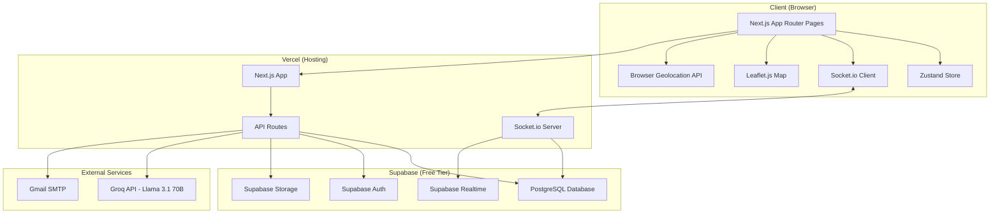
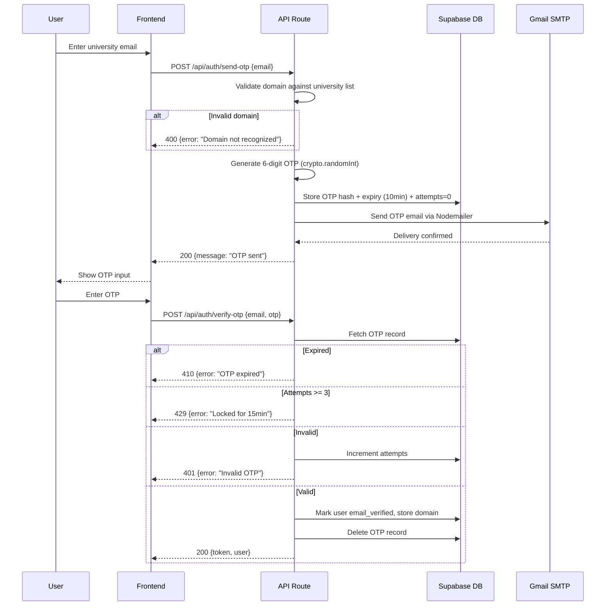
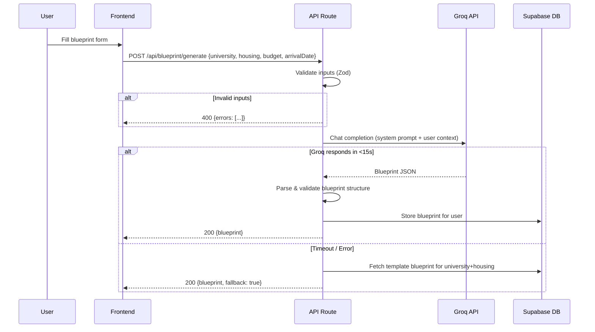
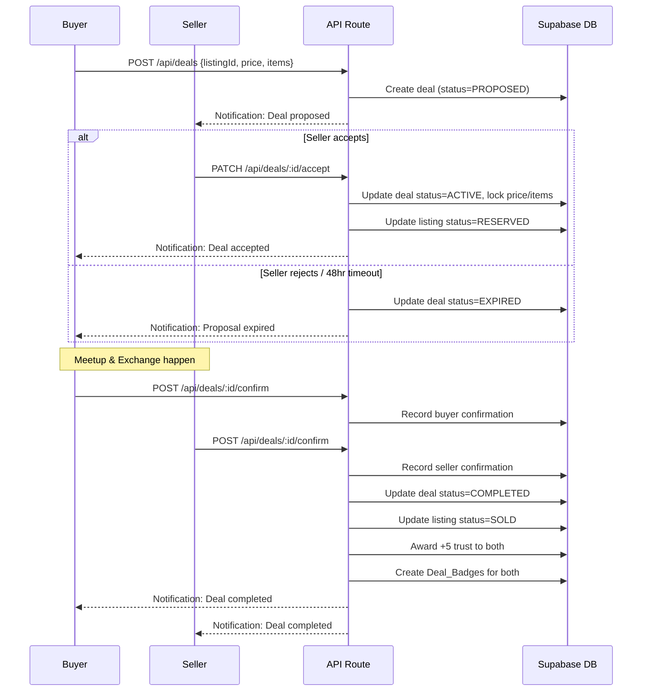
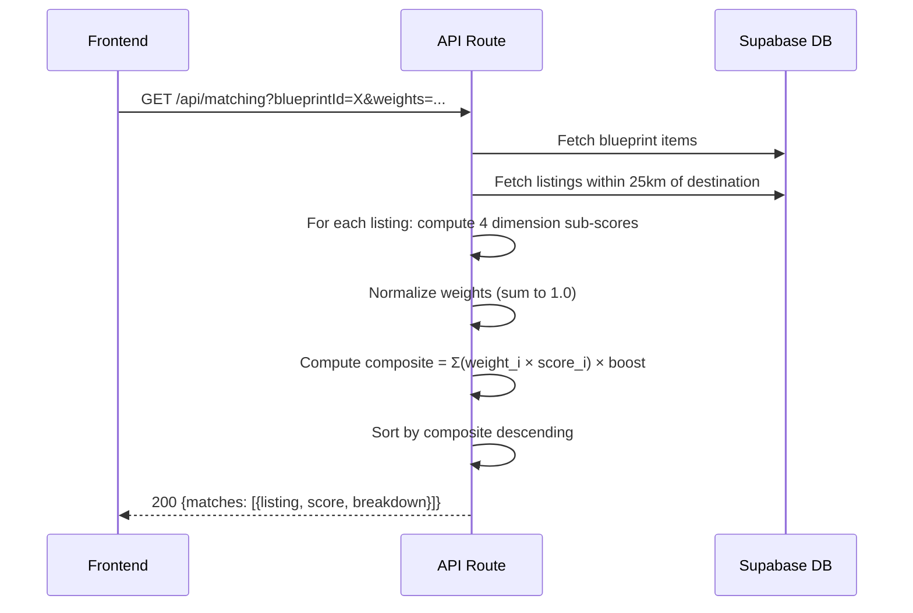

# Design Document: Campus Relocation Network

## Overview

Campus Relocation Network is a Next.js 14 (App Router) full-stack application that connects incoming university students with outgoing students for peer-to-peer item exchange. The system combines AI-powered relocation planning (Groq/Llama 3.1 70B), verified identity through university email OTP, GPS-based location proof, a weighted matching algorithm, real-time Socket.io chat, and a 7-layer anti-fraud architecture — all deployed on free-tier infrastructure (Vercel + Supabase).

The frontend uses shadcn/ui + Tailwind CSS for UI, Framer Motion for animations, Leaflet.js/React-Leaflet for map views, Zustand for state management, and React Hook Form + Zod for validation. The backend leverages Next.js API Routes, Supabase (PostgreSQL + Auth + Storage + Realtime), a custom Socket.io server for chat, Nodemailer + Gmail SMTP for OTP delivery, and Groq free tier for AI generation.

This document specifies the technical architecture, database schema, API surface, component hierarchy, real-time events, AI integration, and security model — mapping each design decision back to the 26 requirements.

## Architecture



## Sequence Diagrams

### OTP Verification Flow (Requirement 1)



### AI Blueprint Generation Flow (Requirement 4)



### Deal Lifecycle Flow (Requirements 12, 14)



### Matching Algorithm Flow (Requirements 9, 25)



## Data Models

## Database Schema

### Core Tables

```typescript
// ============================================================
// USERS & AUTH
// ============================================================

interface users {
  id: string;                    // UUID, PK (Supabase Auth UID)
  email: string;                 // UNIQUE, university email
  display_name: string;          // 2-50 chars
  university_domain: string;     // e.g., "mit.edu"
  email_verified: boolean;       // default false
  document_verified: boolean;    // default false
  location_verified: boolean;    // default false
  campus_id: string | null;      // FK -> campuses.id
  location_verified_at: string | null; // timestamp
  trust_score: number;           // integer >= 0, default 0
  role: 'user' | 'admin';       // default 'user'
  created_at: string;            // timestamp
  updated_at: string;            // timestamp
  wellness_opt_out: boolean;     // default false
}

interface otp_records {
  id: string;                    // UUID, PK
  email: string;                 // target email
  otp_hash: string;              // bcrypt hash of 6-digit code
  expires_at: string;            // timestamp (created_at + 10min)
  attempts: number;              // default 0, max 3
  locked_until: string | null;   // timestamp (set after 3 fails)
  created_at: string;            // timestamp
}

// ============================================================
// UNIVERSITIES & CAMPUSES
// ============================================================

interface university_domains {
  id: string;                    // UUID, PK
  domain: string;                // UNIQUE, e.g., "mit.edu"
  university_name: string;       // display name
  country: string;               // ISO country code
  is_active: boolean;            // admin can disable
  created_at: string;            // timestamp
}

interface campuses {
  id: string;                    // UUID, PK
  university_domain_id: string;  // FK -> university_domains.id
  name: string;                  // campus name
  latitude: number;              // campus center lat
  longitude: number;             // campus center lon
  climate_zone: string;          // e.g., "tropical", "continental"
  country_code: string;          // ISO 3166-1 alpha-2
  created_at: string;            // timestamp
}

// ============================================================
// DOCUMENT VERIFICATION (Requirement 2)
// ============================================================

interface document_uploads {
  id: string;                    // UUID, PK
  user_id: string;               // FK -> users.id
  storage_path: string;          // Supabase Storage path
  status: 'pending' | 'approved' | 'rejected'; // default 'pending'
  reviewed_by: string | null;    // FK -> users.id (admin)
  reviewed_at: string | null;    // timestamp
  rejection_reason: string | null;
  created_at: string;            // timestamp
}

// ============================================================
// BLUEPRINTS & TIMELINES (Requirements 4, 5, 6, 24)
// ============================================================

interface survival_blueprints {
  id: string;                    // UUID, PK
  user_id: string;               // FK -> users.id
  destination_campus_id: string; // FK -> campuses.id
  housing_type: 'dormitory' | 'shared_apartment' | 'studio_apartment' | 'homestay';
  budget_min: number;            // decimal
  budget_max: number;            // decimal
  arrival_date: string;          // date
  climate_info: object | null;   // {avg_high, avg_low, precipitation, season}
  cultural_norms: string[] | null; // array of tip strings
  is_finalized: boolean;         // default false
  created_at: string;            // timestamp
  updated_at: string;            // timestamp
}

interface blueprint_items {
  id: string;                    // UUID, PK
  blueprint_id: string;          // FK -> survival_blueprints.id
  category: 'climate_kit' | 'housing_essentials' | 'electronics_adapters' | 'kitchen_essentials' | 'local_setup_tasks';
  name: string;                  // item name
  description: string | null;    // optional details
  is_obtained: boolean;          // default false
  sort_order: number;            // ordering within category
  created_at: string;            // timestamp
}

interface arrival_timelines {
  id: string;                    // UUID, PK
  blueprint_id: string;          // FK -> survival_blueprints.id
  user_id: string;               // FK -> users.id
  created_at: string;            // timestamp
}

interface timeline_tasks {
  id: string;                    // UUID, PK
  timeline_id: string;           // FK -> arrival_timelines.id
  title: string;                 // task name
  description: string | null;
  day_offset: number;            // relative to arrival (-7 to +14)
  depends_on: string | null;     // FK -> timeline_tasks.id
  is_completed: boolean;         // default false
  completed_at: string | null;   // timestamp
  sort_order: number;            // ordering within same day
}

// ============================================================
// LISTINGS & BUNDLES (Requirements 7, 8, 10)
// ============================================================

interface listings {
  id: string;                    // UUID, PK
  seller_id: string;             // FK -> users.id
  campus_id: string;             // FK -> campuses.id
  title: string;                 // max 100 chars
  description: string;           // max 2000 chars
  price: number;                 // decimal 0.01 - 999999.99
  category: string;              // e.g., "electronics", "furniture"
  condition: 'new' | 'like_new' | 'good' | 'fair';
  status: 'active' | 'reserved' | 'sold';
  bundle_id: string | null;      // FK -> bundles.id (if part of bundle)
  boost_factor: number;          // default 1.0, range 1.0-3.0
  photos: string[];              // array of Supabase Storage URLs
  last_interaction_at: string | null; // for 30-day stale check
  created_at: string;            // timestamp
  updated_at: string;            // timestamp
}

interface bundles {
  id: string;                    // UUID, PK
  seller_id: string;             // FK -> users.id
  title: string;                 // bundle name
  description: string;
  total_price: number;           // combined price
  status: 'draft' | 'active' | 'reserved' | 'sold';
  created_at: string;            // timestamp
}

interface exit_flow_drafts {
  id: string;                    // UUID, PK
  user_id: string;               // FK -> users.id
  draft_data: object;            // JSON blob of in-progress bundles
  expires_at: string;            // created_at + 7 days
  created_at: string;            // timestamp
}

// ============================================================
// DEALS (Requirements 12, 13, 14, 16, 17)
// ============================================================

interface deals {
  id: string;                    // UUID, PK (Deal ID)
  listing_id: string;            // FK -> listings.id
  buyer_id: string;              // FK -> users.id
  seller_id: string;             // FK -> users.id
  status: 'proposed' | 'active' | 'completed' | 'cancelled' | 'expired' | 'disputed';
  locked_price: number;          // frozen at acceptance
  locked_items: object;          // frozen item list
  meetup_time: string | null;    // agreed timestamp
  meetup_lat: number | null;     // agreed location
  meetup_lon: number | null;
  buyer_confirmed: boolean;      // default false
  seller_confirmed: boolean;     // default false
  buyer_confirmed_at: string | null;
  seller_confirmed_at: string | null;
  proposed_at: string;           // timestamp
  accepted_at: string | null;
  completed_at: string | null;
  cancelled_by: string | null;   // FK -> users.id
  cancelled_at: string | null;
  expires_at: string;            // proposal: +48hr, completion: +72hr
  created_at: string;            // timestamp
}

interface deal_badges {
  id: string;                    // UUID, PK
  user_id: string;               // FK -> users.id
  deal_id: string;               // FK -> deals.id
  tier: 'free' | string;        // extensible tier system
  awarded_at: string;            // timestamp
  // UNIQUE constraint on (user_id, deal_id)
}

// ============================================================
// CHAT (Requirement 11)
// ============================================================

interface chat_sessions {
  id: string;                    // UUID, PK
  buyer_id: string;              // FK -> users.id
  seller_id: string;             // FK -> users.id
  listing_id: string;            // FK -> listings.id
  deal_id: string | null;        // FK -> deals.id
  is_restricted: boolean;        // true when deal is active
  created_at: string;            // timestamp
}

interface messages {
  id: string;                    // UUID, PK
  session_id: string;            // FK -> chat_sessions.id
  sender_id: string;             // FK -> users.id
  content: string;               // max 2000 chars
  message_type: 'text' | 'image' | 'video_request' | 'meetup_proposal' | 'system';
  media_url: string | null;      // Supabase Storage URL
  has_contact_warning: boolean;  // if contact info detected
  is_reported: boolean;          // default false
  created_at: string;            // timestamp
}

interface message_reports {
  id: string;                    // UUID, PK
  message_id: string;            // FK -> messages.id
  reporter_id: string;           // FK -> users.id
  reason: string;
  status: 'pending' | 'dismissed' | 'warned';
  reviewed_by: string | null;    // FK -> users.id (admin)
  created_at: string;            // timestamp
}

// ============================================================
// KNOWLEDGE GRAPH (Requirement 18)
// ============================================================

interface knowledge_tips {
  id: string;                    // UUID, PK
  author_id: string;             // FK -> users.id
  campus_id: string;             // FK -> campuses.id
  topic: 'housing' | 'transportation' | 'food' | 'academics' | 'social_life';
  body: string;                  // 20-500 chars
  upvotes: number;               // default 0
  downvotes: number;             // default 0
  created_at: string;            // timestamp
}

interface tip_votes {
  id: string;                    // UUID, PK
  tip_id: string;                // FK -> knowledge_tips.id
  user_id: string;               // FK -> users.id
  vote: 'up' | 'down';
  created_at: string;            // timestamp
  // UNIQUE constraint on (tip_id, user_id)
}

// ============================================================
// TRUST & BEHAVIOR (Requirements 15, 16)
// ============================================================

interface trust_events {
  id: string;                    // UUID, PK
  user_id: string;               // FK -> users.id
  event_type: 'deal_completed' | 'deal_cancelled' | 'dispute' | 'verification_response' | 'verification_ignored' | 'email_verified' | 'document_verified' | 'location_verified' | 'admin_warning';
  points: number;                // +/- value
  reference_id: string | null;   // deal_id or other context
  created_at: string;            // timestamp
}

// ============================================================
// NOTIFICATIONS (Requirement 23)
// ============================================================

interface notifications {
  id: string;                    // UUID, PK
  user_id: string;               // FK -> users.id
  category: 'match' | 'message' | 'deal' | 'wellness' | 'system';
  title: string;
  body: string;
  link: string | null;           // in-app navigation target
  is_read: boolean;              // default false
  created_at: string;            // timestamp
}

interface notification_preferences {
  user_id: string;               // PK, FK -> users.id
  matches_enabled: boolean;      // default true
  messages_enabled: boolean;     // default true
  deals_enabled: boolean;        // default true
  wellness_enabled: boolean;     // default true
}

// ============================================================
// PARTNERSHIPS (Requirement 19)
// ============================================================

interface university_partnerships {
  id: string;                    // UUID, PK
  university_domain_id: string;  // FK -> university_domains.id
  admin_email: string;           // designated university admin
  api_key_hash: string;          // hashed API key
  is_active: boolean;            // default true
  created_at: string;            // timestamp
}

// ============================================================
// ADMIN (Requirement 26)
// ============================================================

interface admin_audit_log {
  id: string;                    // UUID, PK
  admin_id: string;              // FK -> users.id
  action: string;                // e.g., "dispute_resolved", "user_warned"
  target_type: string;           // "deal", "user", "message"
  target_id: string;             // ID of affected entity
  details: object;               // JSON context
  created_at: string;            // timestamp
}
```

## API Endpoints

### Authentication & Verification (Requirements 1, 2, 3)

```typescript
// OTP Flow (Requirement 1)
POST   /api/auth/send-otp           // Send OTP to university email
POST   /api/auth/verify-otp         // Verify OTP, create session
POST   /api/auth/refresh            // Refresh JWT token

// Document Verification (Requirement 2)
POST   /api/verification/document   // Upload document for review
GET    /api/verification/document/status  // Check document status

// Location Verification (Requirement 3)
POST   /api/verification/location   // Submit GPS coords for verification
GET    /api/verification/location/status  // Check location status
```

### AI Engine (Requirements 4, 5, 6)

```typescript
// Blueprint (Requirements 4, 6, 24)
POST   /api/blueprint/generate      // Generate AI survival blueprint
GET    /api/blueprint/:id           // Get specific blueprint
PATCH  /api/blueprint/:id           // Update blueprint (mark items, add/remove)
GET    /api/blueprint/active        // Get user's active blueprint

// Timeline (Requirement 5)
POST   /api/timeline/generate       // Generate arrival timeline
GET    /api/timeline/:id            // Get timeline
PATCH  /api/timeline/:id/tasks/:taskId  // Mark task complete
```

### Marketplace (Requirements 7, 8, 9, 10, 21)

```typescript
// Listings (Requirements 7, 21)
POST   /api/listings                // Create listing
GET    /api/listings                // Search/browse (query, filters, pagination)
GET    /api/listings/:id            // Get listing details
PATCH  /api/listings/:id            // Update listing
DELETE /api/listings/:id            // Remove listing
GET    /api/listings/map            // Listings as GeoJSON for map view

// Bundles (Requirement 8)
POST   /api/bundles                 // Create bundle
GET    /api/bundles/:id             // Get bundle details
POST   /api/exit-flow/start         // Start exit flow session
PATCH  /api/exit-flow/draft         // Save exit flow draft
POST   /api/exit-flow/publish       // Publish all bundles

// Matching (Requirements 9, 25)
GET    /api/matching                // Get matches for blueprint
POST   /api/matching/customize      // Update user weight preferences
```

### Communication (Requirement 11)

```typescript
// Chat
POST   /api/chat/sessions           // Create chat session
GET    /api/chat/sessions           // List user's chat sessions
GET    /api/chat/sessions/:id/messages  // Get message history (paginated)
POST   /api/chat/sessions/:id/messages  // Send message (REST fallback)
POST   /api/chat/sessions/:id/report    // Report a message
```

### Deals (Requirements 12, 13, 14)

```typescript
// Deal Lifecycle
POST   /api/deals                   // Create deal proposal
PATCH  /api/deals/:id/accept        // Accept proposal
PATCH  /api/deals/:id/reject        // Reject proposal
PATCH  /api/deals/:id/cancel        // Cancel deal
POST   /api/deals/:id/confirm       // Submit completion confirmation
POST   /api/deals/:id/meetup        // Propose/confirm meetup
POST   /api/deals/:id/checkin       // Location check-in at meetup
GET    /api/deals/:id               // Get deal details
GET    /api/deals                   // List user's deals
```

### Trust & Reputation (Requirements 15, 16, 17)

```typescript
GET    /api/trust/:userId           // Get user's trust score breakdown
GET    /api/badges/:userId          // Get user's deal badges
```

### Knowledge Graph (Requirement 18)

```typescript
POST   /api/tips                    // Submit a tip
GET    /api/tips                    // Get tips for campus (paginated)
POST   /api/tips/:id/vote           // Vote on tip
```

### Profiles & Notifications (Requirements 22, 23)

```typescript
GET    /api/profile                 // Get own profile
PATCH  /api/profile                 // Update profile
DELETE /api/profile                 // Delete account (with confirmation token)
GET    /api/notifications           // Get notifications (paginated)
PATCH  /api/notifications/:id/read  // Mark as read
PATCH  /api/notifications/preferences  // Update notification preferences
```

### Wellness (Requirement 20)

```typescript
GET    /api/wellness/pulse          // Get current wellness pulse (if due)
POST   /api/wellness/respond        // Submit wellness response
PATCH  /api/wellness/opt-out        // Opt out of wellness checks
```

### Admin (Requirement 26)

```typescript
GET    /api/admin/stats             // Platform statistics
GET    /api/admin/disputes          // Pending disputes
PATCH  /api/admin/disputes/:id      // Resolve dispute
GET    /api/admin/reports           // Message reports
PATCH  /api/admin/reports/:id       // Handle report
POST   /api/admin/domains           // Add university domain
DELETE /api/admin/domains/:id       // Remove university domain
GET    /api/admin/documents         // Pending document reviews
PATCH  /api/admin/documents/:id     // Approve/reject document
PATCH  /api/admin/users/:id/warn    // Warn a user
```

### Partnership API (Requirement 19)

```typescript
GET    /api/partner/analytics       // University dashboard data (API key auth)
POST   /api/admin/partnerships      // Create partnership (admin)
```

## Components and Interfaces

### Page-Level Components (App Router)

```typescript
// Route structure
app/
├── (auth)/
│   ├── login/page.tsx              // Email input + OTP verification
│   └── verify-location/page.tsx    // GPS verification flow
├── (main)/
│   ├── layout.tsx                  // Authenticated layout with nav
│   ├── dashboard/page.tsx          // Role-based dashboard
│   ├── blueprint/
│   │   ├── page.tsx                // Blueprint generation form
│   │   ├── [id]/page.tsx           // Active blueprint with checklist
│   │   └── timeline/page.tsx       // Arrival timeline view
│   ├── marketplace/
│   │   ├── page.tsx                // Browse/search listings
│   │   ├── map/page.tsx            // Map view of listings
│   │   ├── [id]/page.tsx           // Listing detail
│   │   ├── create/page.tsx         // Create single listing
│   │   └── exit-flow/page.tsx      // Bulk listing flow
│   ├── matching/page.tsx           // Matched listings for blueprint
│   ├── chat/
│   │   ├── page.tsx                // Chat session list
│   │   └── [sessionId]/page.tsx    // Active chat
│   ├── deals/
│   │   ├── page.tsx                // Deal list
│   │   └── [id]/page.tsx           // Deal detail + confirm
│   ├── profile/
│   │   ├── page.tsx                // Own profile
│   │   └── [userId]/page.tsx       // Other user's profile
│   ├── tips/page.tsx               // Knowledge graph tips
│   ├── notifications/page.tsx      // Notification center
│   └── settings/page.tsx           // Preferences
├── admin/
│   ├── layout.tsx                  // Admin layout with sidebar
│   ├── page.tsx                    // Admin dashboard stats
│   ├── disputes/page.tsx           // Dispute review
│   ├── reports/page.tsx            // Message reports
│   ├── documents/page.tsx          // Document verification queue
│   ├── domains/page.tsx            // University domain management
│   └── partnerships/page.tsx       // Partnership management
└── api/
    └── [... all API routes as specified above]
```

### Shared UI Components

```typescript
// Component library structure
components/
├── ui/                           // shadcn/ui primitives (Button, Card, Dialog, etc.)
├── auth/
│   ├── OtpInput.tsx              // 6-digit OTP entry
│   ├── EmailForm.tsx             // University email validation
│   └── LocationVerifier.tsx      // GPS verification with progress
├── blueprint/
│   ├── BlueprintForm.tsx         // Generation input form
│   ├── BlueprintChecklist.tsx    // Interactive checklist
│   ├── BlueprintCategory.tsx     // Category section with items
│   └── TimelineView.tsx          // Gantt-style timeline
├── marketplace/
│   ├── ListingCard.tsx           // Listing preview card
│   ├── ListingGrid.tsx           // Grid of listing cards
│   ├── ListingForm.tsx           // Create/edit listing form
│   ├── PhotoUploader.tsx         // Multi-photo upload
│   ├── MapView.tsx               // Leaflet map with markers
│   ├── SearchBar.tsx             // Search with filters
│   └── BundleBuilder.tsx         // Exit flow bundle creator
├── matching/
│   ├── MatchCard.tsx             // Match result with score breakdown
│   ├── WeightSliders.tsx         // Adjustable weight controls
│   └── MatchList.tsx             // Ranked match results
├── chat/
│   ├── ChatWindow.tsx            // Real-time message area
│   ├── MessageBubble.tsx         // Single message display
│   ├── ChatInput.tsx             // Message input with media
│   ├── ContactWarning.tsx        // Contact info detection overlay
│   └── DealProposal.tsx         // In-chat deal proposal UI
├── deals/
│   ├── DealCard.tsx              // Deal summary card
│   ├── DealTimeline.tsx          // Deal status progression
│   ├── ConfirmButton.tsx         // Dual confirmation action
│   └── MeetupScheduler.tsx       // Meetup time/location picker
├── trust/
│   ├── TrustBadge.tsx            // Trust score display
│   ├── VerificationBadges.tsx    // Email/doc/location badges
│   └── DealBadgeList.tsx         // Deal badge gallery
├── profile/
│   ├── ProfileCard.tsx           // User profile summary
│   ├── ProfileEditor.tsx         // Edit profile form
│   └── DeleteAccountModal.tsx    // Deletion confirmation
├── notifications/
│   ├── NotificationBell.tsx      // Header notification icon + count
│   ├── NotificationList.tsx      // Notification feed
│   └── NotificationItem.tsx      // Single notification
├── wellness/
│   ├── WellnessPulse.tsx         // Check-in modal
│   └── ResourceList.tsx          // Mental health resources
├── knowledge/
│   ├── TipCard.tsx               // Knowledge tip with voting
│   ├── TipForm.tsx               // Submit new tip
│   └── TipList.tsx               // Paginated tip feed
└── shared/
    ├── AppShell.tsx              // Main layout wrapper
    ├── Navbar.tsx                // Top navigation
    ├── LoadingSkeleton.tsx       // Loading states
    ├── ErrorBoundary.tsx         // Error handling
    └── AnimatedPage.tsx          // Framer Motion page transitions
```

### Zustand Store Architecture

```typescript
// stores/
interface AuthStore {
  user: User | null;
  isAuthenticated: boolean;
  login: (token: string) => void;
  logout: () => void;
  updateUser: (partial: Partial<User>) => void;
}

interface BlueprintStore {
  activeBlueprint: SurvivalBlueprint | null;
  isGenerating: boolean;
  fetchBlueprint: () => Promise<void>;
  toggleItem: (itemId: string) => void;
  addItem: (categoryId: string, item: BlueprintItem) => void;
  removeItem: (itemId: string) => void;
}

interface MarketplaceStore {
  listings: Listing[];
  filters: SearchFilters;
  pagination: PaginationState;
  setFilters: (filters: Partial<SearchFilters>) => void;
  fetchListings: () => Promise<void>;
}

interface ChatStore {
  sessions: ChatSession[];
  activeSession: string | null;
  messages: Map<string, Message[]>;
  sendMessage: (sessionId: string, content: string) => void;
  addMessage: (sessionId: string, message: Message) => void;
}

interface MatchingStore {
  matches: MatchResult[];
  weights: MatchWeights;
  isLoading: boolean;
  setWeights: (weights: MatchWeights) => void;
  fetchMatches: () => Promise<void>;
}

interface NotificationStore {
  notifications: Notification[];
  unreadCount: number;
  fetchNotifications: () => Promise<void>;
  markRead: (id: string) => void;
}
```

## Real-Time Architecture (Socket.io)

### Server Setup

```typescript
// Socket.io server integrated with Next.js via custom server
// Deployed alongside API routes on Vercel

interface SocketEvents {
  // Client -> Server
  'chat:join': (sessionId: string) => void;
  'chat:leave': (sessionId: string) => void;
  'chat:message': (payload: { sessionId: string; content: string; type: MessageType }) => void;
  'chat:typing': (sessionId: string) => void;

  // Server -> Client
  'chat:new-message': (message: Message) => void;
  'chat:typing-indicator': (payload: { sessionId: string; userId: string }) => void;
  'chat:message-failed': (payload: { tempId: string; error: string }) => void;

  // Notifications (Server -> Client)
  'notification:new': (notification: Notification) => void;
  'notification:deal-update': (payload: { dealId: string; status: DealStatus }) => void;

  // Matching updates (Server -> Client)
  'matching:update': (payload: { blueprintId: string; newMatches: number }) => void;
}
```

### Connection & Authentication

```typescript
// Client connects with JWT token
// Server validates token on connection
// Rooms: user-specific room (user:{userId}) + chat session rooms (chat:{sessionId})

// Message delivery flow:
// 1. Client emits 'chat:message'
// 2. Server persists to Supabase
// 3. Server emits 'chat:new-message' to session room
// 4. If recipient offline: message stored, notification created
// 5. On reconnect: client fetches undelivered messages via REST

// Retry logic:
// Client-side: optimistic update + 30s retry timeout
// Server-side: acknowledge message receipt or emit failure
```

### Contact Info Detection (Requirement 11.7)

```typescript
// Regex patterns for contact detection
const CONTACT_PATTERNS = {
  phone: /(\+?\d{1,4}[\s-]?)?\(?\d{1,4}\)?[\s-]?\d{3,4}[\s-]?\d{3,4}/,
  email: /[a-zA-Z0-9._%+-]+@[a-zA-Z0-9.-]+\.[a-zA-Z]{2,}/,
  social: /(instagram|whatsapp|telegram|snapchat|discord|signal|wechat)\s*[:\-@]?\s*[\w.]+/i,
  url: /https?:\/\/[^\s]+/
};

// Detection happens server-side before persistence
// Message is still sent but flagged with has_contact_warning=true
// Client displays warning overlay on flagged messages
```

## AI Integration Flow (Requirements 4, 5, 6)

### Groq API Integration

```typescript
// Single provider configuration via environment variable
// ENV: GROQ_API_KEY, AI_PROVIDER=groq

interface AIConfig {
  provider: 'groq';              // configurable
  model: 'llama-3.1-70b-versatile';
  maxTokens: 4096;
  temperature: 0.7;
  timeout: 15000;               // 15 second timeout
}

// System prompt structure for blueprint generation
const BLUEPRINT_SYSTEM_PROMPT = `
You are a relocation advisor for university students.
Generate a survival blueprint as JSON with these categories:
- climate_kit: items for the destination climate
- housing_essentials: items for the housing type
- electronics_adapters: tech needs for the country
- kitchen_essentials: cooking/food items
- local_setup_tasks: admin tasks to complete

Tailor to: {climate_zone}, {housing_type}, {budget}, {country}
Include climate data: avg temps, precipitation, season.
Include 3+ cultural norms from: tipping, etiquette, transport, academic culture.
`;

// Response validation with Zod schema
const BlueprintResponseSchema = z.object({
  categories: z.array(z.object({
    name: z.enum(['climate_kit', 'housing_essentials', 'electronics_adapters', 'kitchen_essentials', 'local_setup_tasks']),
    items: z.array(z.object({
      name: z.string(),
      description: z.string().optional(),
      priority: z.enum(['essential', 'recommended', 'optional']),
    })).min(3),
  })).length(5),
  climate_info: z.object({
    avg_high_celsius: z.number(),
    avg_low_celsius: z.number(),
    precipitation_mm: z.number(),
    season_summary: z.string(),
  }).nullable(),
  cultural_norms: z.array(z.string()).min(3),
});
```

### Fallback Strategy

```typescript
// Template blueprints stored in database per campus + housing type
// Fallback triggered when:
// 1. Groq API timeout (>15s)
// 2. Groq API error response
// 3. Response fails Zod validation

async function generateBlueprint(input: BlueprintInput): Promise<Blueprint> {
  try {
    const response = await Promise.race([
      groqClient.chat.completions.create({...}),
      timeout(15000)
    ]);
    const parsed = BlueprintResponseSchema.parse(JSON.parse(response.content));
    return parsed;
  } catch (error) {
    // Serve pre-built template within 3 seconds
    return await getTemplateBluprint(input.campusId, input.housingType);
  }
}
```

## Security Architecture

### Authentication Middleware

```typescript
// middleware.ts - Next.js middleware for route protection
// 1. Public routes: /login, /api/auth/*
// 2. Authenticated routes: all /api/* (except auth), all app pages
// 3. Admin routes: /admin/*, /api/admin/*

// JWT validation:
// - Token stored in httpOnly cookie
// - Supabase JWT verification
// - Role extraction from JWT claims

// Rate limiting (per IP):
// - OTP send: 5 requests per 15 minutes
// - OTP verify: 3 attempts per code
// - API general: 100 requests per minute
// - Location verify: 5 attempts per 24 hours
```

### Row-Level Security (RLS) Policies

```typescript
// Supabase RLS policies for each table:

// users: Users can read own data + public fields of others
// - SELECT own: auth.uid() = id
// - SELECT others: only (id, display_name, university_domain, trust_score, badges)
// - UPDATE: auth.uid() = id (own profile only)

// otp_records: No direct user access (API route only)
// - All operations via service_role key in API

// document_uploads: 
// - INSERT: auth.uid() = user_id
// - SELECT: auth.uid() = user_id OR user.role = 'admin'
// - Storage bucket: private, admin-only read via signed URLs

// listings:
// - SELECT: status = 'active' OR seller_id = auth.uid()
// - INSERT: auth.uid() = seller_id AND user.location_verified = true
// - UPDATE: auth.uid() = seller_id
// - DELETE: auth.uid() = seller_id

// messages:
// - SELECT: auth.uid() IN (session.buyer_id, session.seller_id)
// - INSERT: auth.uid() = sender_id AND user is session participant

// deals:
// - SELECT: auth.uid() IN (buyer_id, seller_id) OR user.role = 'admin'
// - INSERT/UPDATE: participant validation via API

// notifications:
// - SELECT: auth.uid() = user_id
// - UPDATE: auth.uid() = user_id (mark read only)

// knowledge_tips:
// - SELECT: all authenticated users
// - INSERT: user.location_verified = true (outgoing students)

// admin routes: user.role = 'admin' check in middleware
```

### Anti-Fraud 7-Layer Implementation

```typescript
// Layer 1: Identity Gate (Requirement 1)
// - University email domain validation against open dataset
// - One account per email (unique constraint)
// - OTP verification required before any platform action

// Layer 2: Location Proof (Requirement 3)
// - Browser Geolocation API → haversine calculation
// - Compare GPS to campus coordinates (10km threshold)
// - Accuracy metadata check (reject if accuracy > 100m)
// - 90-day expiry with re-verification required
// - Rate limit: 5 verification attempts per 24 hours
// - Store only campus association + timestamp, NEVER raw GPS

// Layer 3: Document Verification (Requirement 2)
// - Private Supabase Storage bucket (admin-only RLS)
// - Admin reviews document, cross-checks email domain
// - After approval: store verification status only
// - Auto-delete original document after 7 days (cron job)

// Layer 4: Behavioral Signals
// - 24-hour cooldown for new users before listing creation
// - Maximum 5 new listings per day per user
// - Chat pattern detection (repeated identical messages flagged)
// - Deal cancellation tracking in trust_events

// Layer 5: Community Protection (Requirement 11.6, 11.7)
// - Report system on messages (admin review queue)
// - Contact info regex detection with warning overlay
// - Price anomaly flags (>3 std deviations from category average)

// Layer 6: Deal Structure (Requirements 12, 14)
// - Locked price/items at deal acceptance (immutable)
// - Dual confirmation required (both parties independently)
// - 72-hour timeout for confirmation
// - Permanent deal history (never deleted)

// Layer 7: Reputation Consequences (Requirement 15)
// - Public trust score on all profiles/listings
// - Penalties: -3 per cancellation, -5 per dispute, -2 per warning
// - Low trust (<20): listings deprioritized in matching
// - One account per university email (no score reset)
// - Trust floor at 0 (never negative)
```

### Document Security Flow

```typescript
// Upload: POST /api/verification/document
// 1. Validate file type (JPEG, PNG, PDF) and size (10KB-5MB)
// 2. Upload to Supabase Storage: private bucket "documents/{userId}/{uuid}.{ext}"
// 3. Create document_uploads record (status: 'pending')
// 4. Admin reviews via signed URL (expires in 1 hour)

// After approval:
// 5. Set user.document_verified = true
// 6. Award trust event (+10 points)
// 7. Schedule document deletion (7 days via Supabase Edge Function or cron)

// RLS: Only service_role can read from documents bucket
// No user (including the uploader) can access the file after upload
```

## Matching Algorithm Implementation (Requirement 25)

```typescript
interface MatchInput {
  blueprint: SurvivalBlueprint;
  listings: Listing[];
  userLocation: { lat: number; lon: number };  // destination campus
  weights: { distance: number; price: number; trust: number; completeness: number };
  boostEnabled: boolean;  // false for now
}

interface MatchResult {
  listing: Listing;
  compositeScore: number;  // 0.0 - 1.0
  breakdown: {
    distanceScore: number;
    priceScore: number;
    trustScore: number;
    completenessScore: number;
  };
}

function computeMatchScore(
  listing: Listing,
  blueprint: SurvivalBlueprint,
  userLat: number,
  userLon: number,
  weights: NormalizedWeights,
  maxTrust: number
): MatchResult {
  // Distance sub-score: 0.0 at 25km, 1.0 at 0km (linear interpolation)
  const distance = haversine(userLat, userLon, listing.campus.lat, listing.campus.lon);
  const distanceScore = Math.max(0, 1 - (distance / 25));

  // Price sub-score: 0.0 at/above budget max, 1.0 = farthest below
  const budgetMax = blueprint.budget_max;
  const priceScore = listing.price >= budgetMax 
    ? 0 
    : (budgetMax - listing.price) / budgetMax;

  // Trust sub-score: normalized 0-1 against max observed trust
  const trustScore = maxTrust > 0 ? listing.seller.trust_score / maxTrust : 0;

  // Completeness sub-score: fraction of blueprint items matched
  const blueprintItems = blueprint.items.map(i => i.name.toLowerCase());
  const matchingItems = blueprintItems.filter(item =>
    listing.title.toLowerCase().includes(item) ||
    listing.description.toLowerCase().includes(item)
  );
  const completenessScore = blueprintItems.length > 0 
    ? matchingItems.length / blueprintItems.length 
    : 0;

  // Composite score (weights already normalized to sum=1.0)
  const composite = 
    weights.distance * distanceScore +
    weights.price * priceScore +
    weights.trust * trustScore +
    weights.completeness * completenessScore;

  // Apply boost factor (1.0 default, 1.0-3.0 range)
  const boostedScore = Math.min(1.0, composite * listing.boost_factor);

  return {
    listing,
    compositeScore: boostedScore,
    breakdown: { distanceScore, priceScore, trustScore, completenessScore }
  };
}

// Weight normalization (Requirement 25.3)
function normalizeWeights(weights: Record<string, number>): NormalizedWeights {
  const sum = Object.values(weights).reduce((a, b) => a + b, 0);
  if (sum === 0) throw new Error("All weights cannot be zero");
  return Object.fromEntries(
    Object.entries(weights).map(([k, v]) => [k, v / sum])
  ) as NormalizedWeights;
}

// Haversine distance calculation
function haversine(lat1: number, lon1: number, lat2: number, lon2: number): number {
  const R = 6371; // Earth radius in km
  const dLat = toRad(lat2 - lat1);
  const dLon = toRad(lon2 - lon1);
  const a = Math.sin(dLat/2)**2 + 
            Math.cos(toRad(lat1)) * Math.cos(toRad(lat2)) * Math.sin(dLon/2)**2;
  return R * 2 * Math.atan2(Math.sqrt(a), Math.sqrt(1-a));
}
```

## Trust Score Computation (Requirement 15)

```typescript
function computeTrustScore(userId: string, events: TrustEvent[]): number {
  let score = 0;

  for (const event of events) {
    switch (event.event_type) {
      case 'email_verified':       score += 20; break;
      case 'document_verified':    score += 10; break;
      case 'location_verified':    score += 10; break;
      case 'deal_completed':       score += 5;  break;
      case 'deal_cancelled':       score -= 3;  break;
      case 'dispute':              score -= 5;  break;
      case 'verification_response': score += 2; break;
      case 'verification_ignored': score -= 1;  break;
      case 'admin_warning':        score -= 2;  break;
    }
  }

  // Floor at 0 (Requirement 15.4)
  return Math.max(0, score);
}

// Triggered by trust-affecting events:
// - Computed from full event history (not incremental)
// - Must complete within 5 seconds (Requirement 15.3)
// - Stored denormalized on users.trust_score for fast reads
```

## File/Folder Structure

```
MoveKit/
├── .kiro/                          # Kiro spec files
├── public/
│   ├── images/                     # Static assets
│   └── templates/                  # Fallback blueprint templates (JSON)
├── src/
│   ├── app/
│   │   ├── (auth)/
│   │   │   ├── login/page.tsx
│   │   │   └── verify-location/page.tsx
│   │   ├── (main)/
│   │   │   ├── layout.tsx
│   │   │   ├── dashboard/page.tsx
│   │   │   ├── blueprint/[...pages]
│   │   │   ├── marketplace/[...pages]
│   │   │   ├── matching/page.tsx
│   │   │   ├── chat/[...pages]
│   │   │   ├── deals/[...pages]
│   │   │   ├── profile/[...pages]
│   │   │   ├── tips/page.tsx
│   │   │   ├── notifications/page.tsx
│   │   │   └── settings/page.tsx
│   │   ├── admin/[...pages]
│   │   ├── api/
│   │   │   ├── auth/
│   │   │   ├── blueprint/
│   │   │   ├── timeline/
│   │   │   ├── listings/
│   │   │   ├── bundles/
│   │   │   ├── exit-flow/
│   │   │   ├── matching/
│   │   │   ├── chat/
│   │   │   ├── deals/
│   │   │   ├── trust/
│   │   │   ├── tips/
│   │   │   ├── profile/
│   │   │   ├── notifications/
│   │   │   ├── wellness/
│   │   │   ├── admin/
│   │   │   ├── partner/
│   │   │   └── verification/
│   │   ├── layout.tsx
│   │   └── page.tsx               # Landing page
│   ├── components/
│   │   ├── ui/                    # shadcn/ui components
│   │   ├── auth/
│   │   ├── blueprint/
│   │   ├── marketplace/
│   │   ├── matching/
│   │   ├── chat/
│   │   ├── deals/
│   │   ├── trust/
│   │   ├── profile/
│   │   ├── notifications/
│   │   ├── wellness/
│   │   ├── knowledge/
│   │   └── shared/
│   ├── lib/
│   │   ├── supabase/
│   │   │   ├── client.ts          # Browser Supabase client
│   │   │   ├── server.ts          # Server-side Supabase client
│   │   │   └── admin.ts           # Service role client
│   │   ├── ai/
│   │   │   ├── groq.ts            # Groq API client
│   │   │   ├── prompts.ts         # System prompts
│   │   │   └── templates.ts       # Fallback templates
│   │   ├── matching/
│   │   │   ├── algorithm.ts       # Core matching logic
│   │   │   └── haversine.ts       # Distance calculation
│   │   ├── trust/
│   │   │   └── calculator.ts      # Trust score computation
│   │   ├── chat/
│   │   │   ├── socket-server.ts   # Socket.io server setup
│   │   │   └── contact-detect.ts  # Contact info regex
│   │   ├── email/
│   │   │   └── nodemailer.ts      # SMTP client setup
│   │   ├── validation/
│   │   │   ├── schemas.ts         # Zod schemas
│   │   │   └── domains.ts         # University domain list
│   │   └── utils/
│   │       ├── auth.ts            # JWT helpers
│   │       ├── rate-limit.ts      # Rate limiting
│   │       └── constants.ts       # App constants
│   ├── stores/
│   │   ├── auth.ts
│   │   ├── blueprint.ts
│   │   ├── marketplace.ts
│   │   ├── chat.ts
│   │   ├── matching.ts
│   │   └── notifications.ts
│   ├── hooks/
│   │   ├── useSocket.ts           # Socket.io hook
│   │   ├── useGeolocation.ts      # GPS hook
│   │   ├── useNotifications.ts    # Notification hook
│   │   └── useDebounce.ts         # Debounce hook
│   └── types/
│       ├── database.ts            # Generated Supabase types
│       ├── api.ts                 // API request/response types
│       └── socket.ts              // Socket event types
├── supabase/
│   ├── migrations/                # SQL migration files
│   ├── seed.sql                   # Admin seed + template data
│   └── config.toml                # Supabase config
├── tests/
│   ├── unit/
│   │   ├── matching.test.ts
│   │   ├── trust.test.ts
│   │   └── blueprint-serialization.test.ts
│   └── property/
│       ├── matching.property.ts
│       ├── trust.property.ts
│       └── blueprint.property.ts
├── .env.local                     # Local env vars
├── .env.example                   # Template
├── next.config.js
├── tailwind.config.ts
├── tsconfig.json
├── package.json
└── README.md
```

## Error Handling

### Error Scenario 1: AI Provider Unavailable (Requirements 4.5, 5.4)

**Condition**: Groq API returns error or exceeds 15-second timeout
**Response**: Catch error, log to console, serve pre-built template from database/JSON
**Recovery**: Template served within 3 seconds; user informed blueprint is template-based

### Error Scenario 2: OTP Delivery Failure (Requirement 1)

**Condition**: Nodemailer fails to send via Gmail SMTP
**Response**: Return 500 with user-friendly message; log error details server-side
**Recovery**: User can retry after 30 seconds; rate limits still apply

### Error Scenario 3: WebSocket Disconnection (Requirement 11.5)

**Condition**: Client loses Socket.io connection
**Response**: Client-side: queue messages, show "connecting" indicator; retry for 30 seconds
**Recovery**: On reconnect, fetch missed messages via REST; if delivery fails after 30s, show "not sent" indicator

### Error Scenario 4: GPS Unavailable (Requirement 3.6)

**Condition**: Browser denies geolocation permission or timeout exceeds 30 seconds
**Response**: Display instructional modal for enabling location services
**Recovery**: User can retry after granting permission; no verification recorded until successful

### Error Scenario 5: Deal Confirmation Timeout (Requirement 14.4, 14.5)

**Condition**: One or both parties don't confirm within 72 hours
**Response**: If one confirmed: flag for dispute. If neither: mark EXPIRED, return listing to ACTIVE
**Recovery**: Scheduled job runs every hour checking deal expiry

## Correctness Properties

### Property 1: Matching Algorithm Score Bounds (Requirement 25.1)
**Property**: For ALL listing-blueprint pairs, the composite score is between 0.0 and 1.0 inclusive.
**Validates: Requirements 25.1**
**Test**: Generate random listings and blueprints with random weights; verify score ∈ [0.0, 1.0].

### Property 2: Matching Algorithm Determinism (Requirement 25.2)
**Property**: For identical inputs, the matching algorithm produces identical scores regardless of execution order.
**Validates: Requirements 25.2**
**Test**: Run same inputs multiple times with shuffled listing order; verify identical output ordering and scores.

### Property 3: Weight Normalization Invariant (Requirement 25.3)
**Property**: After normalization, all weights sum to exactly 1.0 (within floating-point tolerance).
**Validates: Requirements 25.3**
**Test**: Generate arbitrary positive weight vectors; verify post-normalization sum ≈ 1.0 (±1e-10).

### Property 4: Matching Monotonicity (Requirement 25.5)
**Property**: If listing A is better than listing B on one dimension (all others equal), A's composite score ≥ B's composite score.
**Validates: Requirements 25.5**
**Test**: Generate pairs of listings differing on one dimension; verify score ordering.

### Property 5: Trust Score Floor (Requirement 15.4)
**Property**: For ALL event histories, the computed trust score is ≥ 0.
**Validates: Requirements 15.4**
**Test**: Generate random sequences of trust events (including heavy penalty sequences); verify score ≥ 0.

### Property 6: Blueprint Serialization Round-Trip (Requirement 24.3)
**Property**: For ALL valid blueprints, serialize(deserialize(serialize(blueprint))) === serialize(blueprint).
**Validates: Requirements 24.3**
**Test**: Generate random valid blueprints; verify JSON round-trip preserves all data.

### Property 7: Trust Score Additivity
**Property**: Trust score computed from events [A, B] equals trust from [B, A] (order-independent for accumulated score).
**Validates: Requirements 15.1, 15.3**
**Test**: Generate random event sequences; shuffle and recompute; verify identical result.

## Testing Strategy

### Unit Testing Approach

- Test pure functions: matching algorithm, trust computation, haversine, contact detection
- Test Zod validation schemas for all API inputs
- Test blueprint serialization/deserialization round-trips
- Framework: Vitest (fast, TypeScript-native)

### Property-Based Testing Approach

- **Property Test Library**: fast-check (TypeScript)
- Test matching algorithm monotonicity and score bounds
- Test trust score computation properties (floor at 0, deterministic)
- Test blueprint serialization round-trip property
- Test weight normalization invariants

### Integration Testing Approach

- Test API routes with Supabase test database
- Test Socket.io message delivery end-to-end
- Test OTP flow (mock SMTP)
- Test deal lifecycle state transitions
- Framework: Vitest + supertest for API routes

## Performance Considerations

- **Matching Algorithm**: Must score up to 1000 listings within 3 seconds (Req 25.6) — pre-filter by 25km radius using PostgreSQL spatial query, then score in-memory
- **Search**: PostgreSQL full-text search with GIN index on listings(title, description) for <3s results (Req 21.1)
- **Image Loading**: Supabase Storage CDN with optimized images (<3s on broadband) (Req 7.7)
- **Real-time Chat**: Socket.io with connection pooling; 2s max latency (Req 11.4)
- **Trust Score Updates**: Triggered event-based, computed from indexed trust_events table (<5s) (Req 15.3)
- **Notification Delivery**: Supabase Realtime subscriptions for instant in-app delivery

## Dependencies

| Package | Purpose | Requirement |
|---------|---------|-------------|
| next@14 | App framework | All |
| @supabase/supabase-js | Database + Auth + Storage | All |
| socket.io / socket.io-client | Real-time chat | 11 |
| nodemailer | OTP email delivery | 1 |
| groq-sdk | AI blueprint generation | 4, 5, 6 |
| leaflet / react-leaflet | Map display | 21 |
| zustand | Client state management | All |
| react-hook-form | Form handling | All |
| zod | Schema validation | All |
| framer-motion | Animations | UX |
| bcryptjs | OTP hashing | 1 |
| fast-check | Property-based testing | Testing |
| vitest | Test runner | Testing |

## Requirements Traceability Matrix

| Requirement | Key Design Components |
|-------------|----------------------|
| 1. Email Verification | otp_records table, /api/auth/*, Nodemailer, university_domains table |
| 2. Document Badge | document_uploads table, Supabase Storage (private), admin review flow |
| 3. Location Verification | campuses table, Browser Geolocation API, haversine.ts |
| 4. AI Blueprint | survival_blueprints + blueprint_items tables, Groq API, fallback templates |
| 5. Arrival Timeline | arrival_timelines + timeline_tasks tables, Groq API |
| 6. Climate/Culture | climate_zone on campuses, AI prompt enrichment |
| 7. Listing Creation | listings table, Supabase Storage (photos), PhotoUploader component |
| 8. Exit Flow | bundles + exit_flow_drafts tables, BundleBuilder component |
| 9. Matching | matching/algorithm.ts, WeightSliders, /api/matching |
| 10. Boosted Listings | boost_factor column, disabled UI button |
| 11. Chat | chat_sessions + messages tables, Socket.io, contact-detect.ts |
| 12. Deal Creation | deals table, /api/deals/*, DealProposal component |
| 13. Exchange Support | meetup fields on deals, /api/deals/:id/checkin |
| 14. Dual Confirmation | buyer_confirmed/seller_confirmed on deals, ConfirmButton |
| 15. Trust Score | trust_events table, trust/calculator.ts, TrustBadge component |
| 16. Value Lock | Dual_Confirmation pathway only, no alternative trust gain |
| 17. Deal Badge | deal_badges table, tier system, DealBadgeList component |
| 18. Knowledge Graph | knowledge_tips + tip_votes tables, TipCard component |
| 19. Partnership | university_partnerships table, /api/partner/*, API key auth |
| 20. Wellness | notification_preferences, /api/wellness/*, WellnessPulse component |
| 21. Search/Browse | PostgreSQL FTS, filters, MapView, /api/listings?query= |
| 22. Profile | users table, ProfileEditor, DeleteAccountModal |
| 23. Notifications | notifications + notification_preferences tables, Socket.io events |
| 24. Serialization | Zod schemas for blueprint, JSON storage, round-trip validation |
| 25. Matching Algorithm | computeMatchScore(), normalizeWeights(), haversine() |
| 26. Admin Dashboard | /admin routes, admin RLS, admin_audit_log table |
